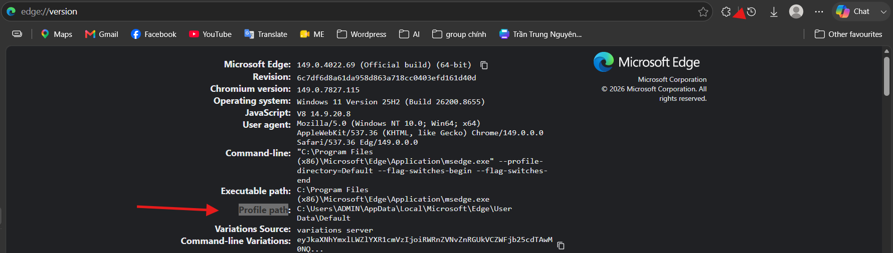

# 🎧 Audio Batch Generator (Playwright + Edge CDP)

Tool tự động chia text dài thành nhiều đoạn, gửi vào web TTS (Vbee), tạo audio và tải về máy bằng Playwright điều khiển Microsoft Edge qua Remote Debugging.

---

## 🚀 Tính Năng

- ✅ Tự động chia text dài thành nhiều chunk
- ✅ Tự động paste vào editor trên web
- ✅ Click nút Preview để generate audio
- ✅ Detect audio mới được tạo
- ✅ Tải file mp3 về máy
- ✅ Retry khi server bị treo
- ✅ Tự động reload page khi lỗi
- ✅ Tiếp tục chạy chunk đang lỗi

---

## 📁 Cấu Trúc Dự Án

```
audio-tool/
├── src/
│   ├── index.js
│   ├── textSplitter.js
│   └── processChunk.js
│
├── config.json
├── input.txt
├── package.json
├── package-lock.json
└── downloads/
```

---

## ⚙️ Cài Đặt

### 1. Cài đặt dependencies

```bash
npm install
```

### 2. Cài đặt Playwright browser

```bash
npx playwright install
```

---

## ▶️ Chạy Dự Án

### Step 1: Mở Edge với remote debugging

```bash
"C:\Program Files (x86)\Microsoft\Edge\Application\msedge.exe" ^
--remote-debugging-port=9222 ^
--profile-directory="Profile 2"
```

> ⚠️ **Cách check profile cần mở lên :**: Mở Profile edge và truy cập "edge://version/" và check Profile Path


> ⚠️ **Lưu ý:** Phải đóng toàn bộ Edge trước khi chạy lệnh này

```bash
taskkill /F /IM msedge.exe
```

### Step 2: Chạy tool

```bash
npm start
```

---

## 🔧 Cấu Hình

Chỉnh sửa file `config.json`:

```json
{
  "inputSelector": ".public-DraftEditor-content",
  "buttonSelector": ".preview-button-wrapper button",
  "delayMs": 5000,
  "chunkSize": 1000,
  "downloadPath": "D:\\Audio\\Vbee",
  "filePrefix": "audio_",
  "waitAudioTimeout": 90000,
  "delayBetweenChunks": 2000,
  "startIndex": 1,
  "inputFile": "./input.txt"
}
```

### Các tham số cấu hình:

| Tham số | Mô tả |
|---------|-------|
| `inputSelector` | Selector của editor input |
| `buttonSelector` | Selector của nút Preview |
| `chunkSize` | Số ký tự mỗi chunk |
| `downloadPath` | Đường dẫn lưu audio |
| `filePrefix` | Tiền tố tên file |
| `waitAudioTimeout` | Timeout chờ audio (ms) |
| `delayBetweenChunks` | Delay giữa các chunk (ms) |

---

## 📄 Input Text

### Option 1: Dùng file (khuyến nghị) ⭐

Sử dụng file `input.txt`:

```txt
Nội dung text cần chuyển thành audio...

```

---

## 📦 Output

File audio sẽ được lưu tại thư mục được cấu hình:

```
D:\Audio\Vbee\
├── audio_001.mp3
├── audio_002.mp3
├── audio_003.mp3
└── ...
```

---

## 🔁 Logic Retry & Recovery

Tool sẽ tự động:

- 🔄 Retry khi server bị treo
- 🔄 Reload page khi có lỗi
- 🔄 Làm lại chunk hiện tại cho đến khi thành công
- 🔄 Tiếp tục xử lý chunk tiếp theo

---

## 🧠 How It Works

```
Split Text → Paste → Click Preview → Detect Audio → Download → Next Chunk
```

## ⚠️ Requirements
- Node.js >= 18
- Microsoft Edge installed
- Playwright installed
- Edge phải chạy với: --remote-debugging-port=9222


## 🛠 Troubleshooting
❌ Cannot connect to Edge
   Kiểm tra:
   http://127.0.0.1:9222/json/version
❌ Preview button không hoạt động
   Kiểm tra selector trong config.json
   Kiểm tra text đã được select (Ctrl + A logic)
❌ Audio không update
   Tăng delayMs
   Kiểm tra server có bị lag
   
## 📌 Notes
- Tool dùng Edge profile thật → giữ nguyên login & cookie
- Không cần extension
- Không cần API
- Chạy hoàn toàn trên UI automation
